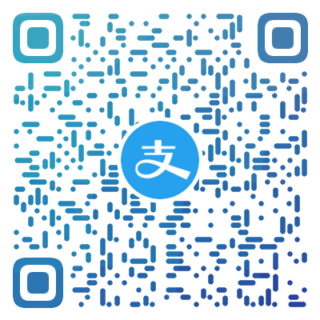
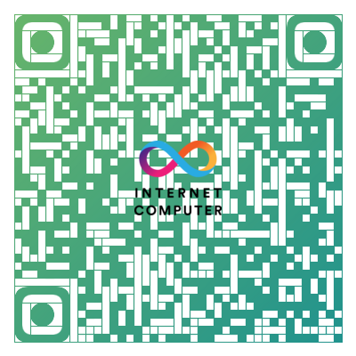

## It's Alex.

Thanks for visiting my profile page.

Couple things about me:
- 🌱 Full-time **Flutter**er.
- 🏅 [Flutter GDE (Google Developer Expert)](https://developers.google.com/community/experts/directory/profile/profile-chengjun-li) and a contributor with contributor access of the Flutter organization.
- 👯 Maintainer of [China Flutter User Group (CFUG)](https://github.com/cfug) , and hope to collaborate with any team related to Flutter in China.
- 🤝 Member of some Flutter organizations in the community, such as [FlutterCandies](https://github.com/fluttercandies).
- ✍🏻 Wrote articles on [juejin.cn](https://juejin.cn/user/606586150596360) and my [Blog](https://blog.alexv525.com/).
- 🚀 Active on GitHub and participate the development with many projects and repositories.

### Contact me 📫 :
  - 🏠 Personal: github@alexv525.com
  - 📋 Work: job@alexv525.com

### Rewards 🏆

- 2022 [GitHub China Top 99 Impact](https://opensource.win/AlexV525/) (Ranking #13).
  -blueviolet)
- Wins [2022 Google Open Source Peer Bonus](https://opensource.googleblog.com/2022/03/Announcing-First-Group-of-Google-Open-Source-Peer-Bonus-Winners-in-2022.html).
  

### Buy me anything 🍕

If any of my codes or ideas helped you, feel free to sponsor me by:

|            Alipay            |            WeChat            |           DCEP           |          ICP           |
|:----------------------------:|:----------------------------:|:------------------------:|:----------------------:|
|  |  |  |  |
